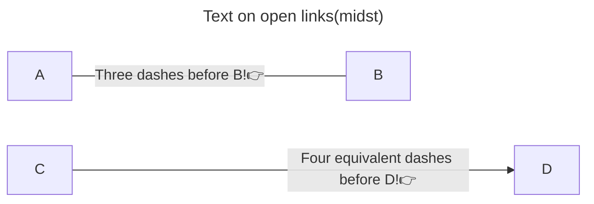
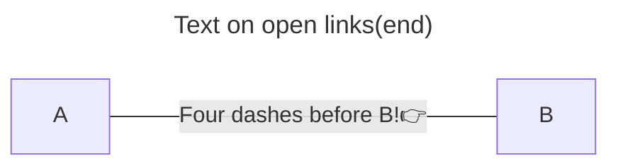
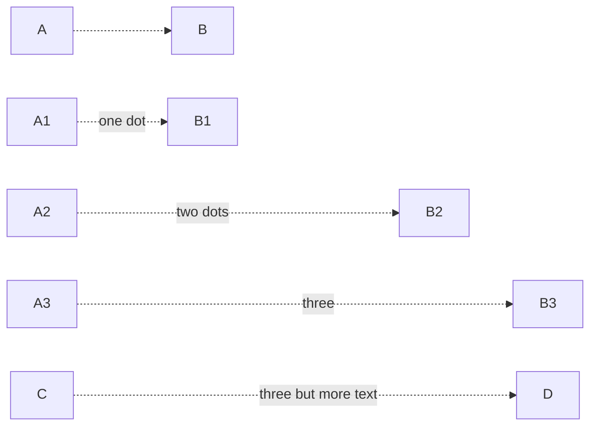
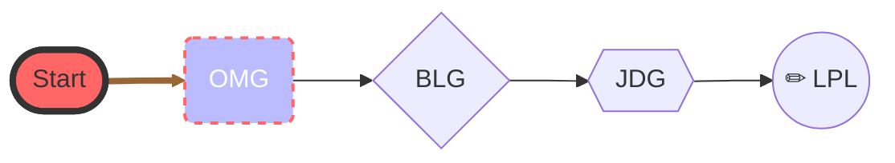

深圳市医疗企业研发岗。 ^Job

薪资待遇：13k/月（试用期少2k，为期6月，期间无住房公积金缴纳）。个税、五险一金、住宿水电总计花费1.5k。加班费基本按深圳最低工资[^lowsalary]为基数给，工作日~30¥/h (150%)，周末加班~40¥/h (200%)。非深圳户籍的五险一金按低标准（深圳二档）缴纳，应地方法规要求才会给广户缴纳最高档。 ^Offer

应届生报销入职交通费，前半年免房租，水电照交。
茶点零食聊胜于无，部门团建经费 200¥/每季度/人头。
应届生工资与岗位/学校有关，加学历补贴。 ^c1689e

| 学校 | 月薪 |
| -- | :--: |
| 西交 | 13k |
| 重大 | 12k |
| 中南民族（一本） | 9k（研发）/7k（财务） |
| 柳州工学院(二本) | 8.5k |
| 武汉纺织大学（二本） |7k |

在公司里，所在部门在研发系统内独立于开发部与中试部。而直接上级和部门领导是非对口技术出身，部门内的研发项目只有我和另一位重庆大学的本科同届生独自奋斗。

[^lowsalary]: 员工合同的签约工资是当地最低工资，作为基本工资，offer 差额工资以补贴形式发放，以便降低福利。