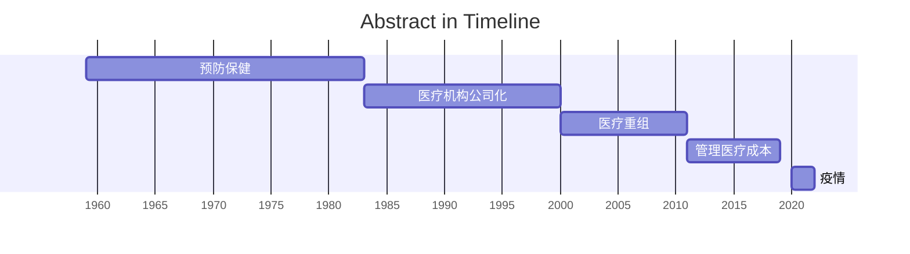

# Timeline Change

求解微分方程 $y^{\prime\prime} + 4y = \sin(2x)$，并解释为何特解形式需要调整为 $y_p=x(A\cos2x+B\sin2x)$
# Timeline
```
	南昌大学            : 11:00
	南昌大学 -> 万象天地 : 20 min
	万象天地            : 11:30
	
13:30
	万象天地 -> 万寿宫   : 40 min (14:10)
	万寿宫              : 40 min (15:00)
	万寿宫 -> 东湖意库   : 40 min (15:40)
	东湖意库            : 16:30
	东湖意库 -> 秋水广场 : 1h (17:20)
	秋水广场 -> 南昌西站 : 40 min (18:00)
	南昌西站            : 18:20
19:30
```

建议启用的本地 Mod：
- [Chinese Plus](https://steamcommunity.com/sharedfiles/filedetails/?id=572538624)
- [Combined Status](https://steamcommunity.com/sharedfiles/filedetails/?id=376333686)
	- 丰富角色右上角属性栏，显示具体数值。
- [Extra Equip Slot Plus+](https://steamcommunity.com/sharedfiles/filedetails/?id=2823530744)
- [Minimap HUD](https://steamcommunity.com/sharedfiles/filedetails/?id=345692228)

> [!info]- [世界是对数的吗？](https://www.bilibili.com/video/BV15kj4z4Eju/#reply262694983201)
> 
> 引人深思的好视频。虽然从数学形式上能很好理解加法形成正态分布和乘法形成指数/对数分布，但乘法本质上也是加法（?），为什么能导致这么巨大的差异？  
宇宙膨胀的倍数是符合直觉的，但很好奇 B 站用户的粉丝是否满足本福特定律，毕竟 B 站粉丝数量其实是加法计数。就像人口增长，国民年度人口增长总额其实是各家庭新生人口的总和，是否是为了统计分析上的刻画方便，构造了增长率，继而各国人口分布满足了 Benford's Law 呢？或许上述表述的内在逻辑是颠倒的，人口繁衍（的冲动）客观服从倍数增长，故而对人口增长这个现实场景采用增长率作为口径。
问了 Gemini 后，我才反应过来最开头的 ? 里应该填什么：乘法实质是缩放。只有在整数下，乘法可以视作重复的加法；当拓展到有理数（分数）、无理数时，乘法不等同于加法，½ × ⅓ ≠ ½ + ⅓ 。
> 
> 发现有人已经做过统计了，2w 以内博主的粉丝数服从幂律分布。
> 
> https://zhuanlan.zhihu.com/p/126679028
> 
> 视频里提到突触间的信号传递具有放大效应。其实神经元内的信号也可以建模成电子学中典型线性放大器中的一类，跟随器。到达阈值电位前的表现就像截止区，到达阈值电位后的表现就像饱和区，动作电位沿轴突传导几乎不衰减。
> 有意思的是，尽管宏观上人类对刺激强度的感知是对数的，但微观上的剂量反应曲线在对数浓度轴上通常为 S 型曲线而不是均匀分布。
> 

